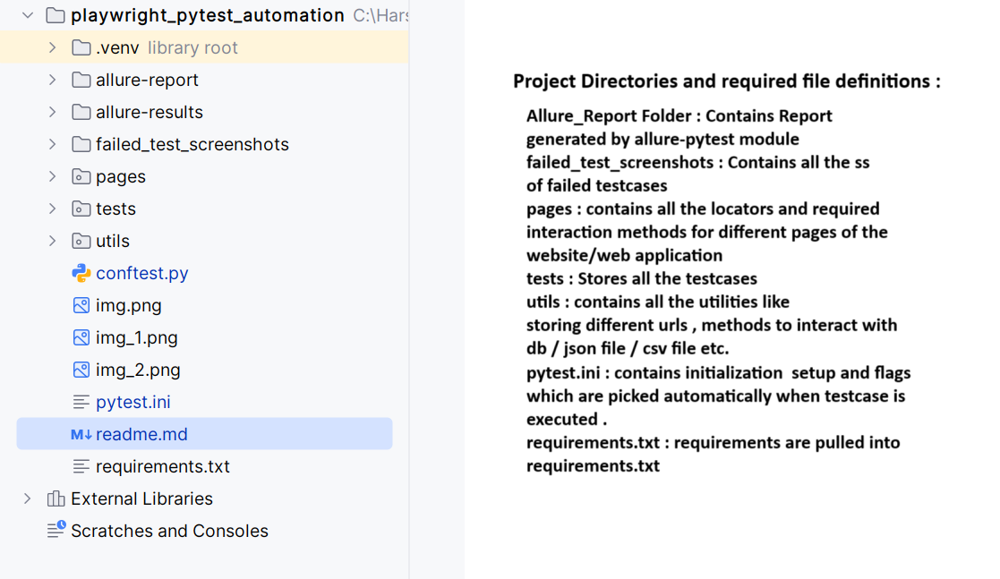

# Pytest playwright Web Automation Framework

## Features
1. Page Object Model
2. Screenshot on Test Failure
3. Parallel execution of testcases 
4. Automatic Waits 
5. Debugging using playwright debugger
6. Recording Test scripts Preparation using playwright's codegen feature
7. Easily find Web elements using playwright's pick locator feature
8. HTML Reporting with generating the report for each finished test instead of test run completion
9. Data driven testing with database connectivity

and many more ....


The Demo illustrated uses this website -
https://katalon-demo-cura.herokuapp.com/


### Using playwright's codegen feature to locate webelements and record test scripts -

Command to run codegen - 
```aiignore
(.venv) PS C:\Harsh_Personal\Automation\playwright_pytest_automation> playwright codegen https://katalon-demo-cura.herokuapp.com/
```

Command to generate Allure test report in project directory-
```aiignore
allure generate allure-results --clean -o allure-report
```

Using Pick Locator - 


Locator displayed in playwright's inspector locator tab-


Screenshot on Failure - 


File Structure Overview - 


Debugging Tests (by applying brekpoint 
using page.pause() and resume , stepover and pause tools from playwright debugger menu)

